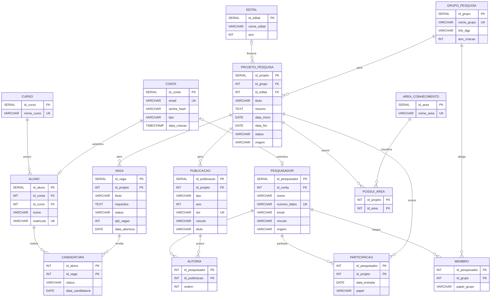

# Scientia - Hub de Produção Científica do BCC/UFAPE

## Integrantes
[Lucas Feitoza](https://github.com/hazdriel) | [Carlos Gabyrel Espianhara](https://github.com/cgabryel0) | [Laura Vitória Mendes](https://github.com/l4uramendes)

Heitor Calado Duque de Araújo integra o grupo apenas na disciplina de Banco de
Dados, por isso não aparece nos commits do restante do projeto.

## Entrega de Banco de Dados — Implementação e Visões

**Responsável pela finalização desta entrega:** Laura Vitória Mendes.

A entrega integra banco, backend e frontend em um único `docker compose`, com CRUD de
projetos, publicações, grupos, vagas e candidaturas e com três Views SQL não triviais.

### Portas da aplicação

| Serviço | Porta no computador | Serviço Docker |
|---|---:|---|
| PostgreSQL | `5432` | `db` |
| Backend / API | `3000` | `backend` |
| Frontend | `5173` | `frontend` |

A comunicação interna do backend com o banco usa `db:5432`, e não `localhost`. O
frontend é servido pelo Nginx em `http://localhost:5173` e acessa a API em
`http://localhost:3000/api`.

### Execução integral com Docker

```bash
docker compose down -v
docker compose up --build
```

Depois da inicialização, acesse `http://localhost:5173`. O `-v` é importante quando
for necessário recriar o banco e executar novamente os scripts de `database/init`.

### Banco, esquema e povoamento

O esquema conceitual/lógico atualizado está documentado em
`database/docs/diagrama-logico-uml.png` e `database/docs/diagrama-logico.mermaid`. O
dicionário de dados está em `database/docs/dicionario-de-dados.pdf`.

O banco é criado automaticamente pelos scripts abaixo, executados pelo PostgreSQL na
ordem alfabética:

1. `database/init/01-schema.sql`: tabelas, PKs, FKs, constraints e índices.
2. `database/init/02-seed.sql`: povoamento reprodutível com cursos, contas, alunos,
   pesquisadores, editais, grupos, projetos, publicações, vagas, vínculos, autorias e
   candidaturas. Parte dos dados é gerada com `generate_series` para formar um volume
   maior e consistente de registros relacionados.
3. `database/init/03-views.sql`: criação das três Views da entrega.
4. `database/init/04-triggers.sql`: criação dos gatilhos (triggers) da entrega.

### Views da entrega

| View | Finalidade | Principais relações |
|---|---|---|
| `v_projetos_detalhados` | Resumo de projeto com grupo, edital e quantidade de publicações | `projeto_pesquisa`, `grupo_pesquisa`, `edital`, `publicacao` |
| `v_producao_bibliografica` | Produção bibliográfica com projeto, grupo, autor e ordem de autoria | `publicacao`, `projeto_pesquisa`, `grupo_pesquisa`, `autoria`, `pesquisador` |
| `v_grupos_pesquisa` | Indicadores de membros, liderança e projetos por grupo | `grupo_pesquisa`, `membro`, `pesquisador`, `projeto_pesquisa` |

A tela **Relatórios** (`/relatorios`) consome os endpoints
`/api/relatorios/projetos`, `/api/relatorios/publicacoes` e
`/api/relatorios/grupos`. O backend consulta diretamente as Views em vez de repetir os
JOINs e agregações.

### Gatilhos (Triggers) da entrega

O arquivo `database/init/04-triggers.sql` implementa dois recursos automatizados:

**1. Auditoria de publicações (`trg_auditar_publicacao`)** — toda inserção, alteração ou
exclusão na tabela `publicacao` é registrada automaticamente em `auditoria_publicacao`,
com a operação, os dados antigos e novos (JSONB) e a data da ocorrência.

**2. Gestão automática de vagas (`trg_bloquear_candidatura_vaga_fechada` e
`trg_fechar_vaga_preenchida`)** — o banco impede a criação de candidatura para vaga
`fechada` (regra que a API já validava, agora garantida também na camada de dados) e
fecha a vaga automaticamente quando as candidaturas aprovadas atingem `qtd_vagas` —
efeito visível na interface ao aprovar a última candidatura de uma vaga.

Como testar (com os containers rodando, `docker compose exec db psql -U scientia -d scientia`):

```sql
-- Auditoria: alterar uma publicação e consultar o histórico
UPDATE publicacao SET titulo = titulo || ' (revisado)' WHERE id_publicacao = 1;
SELECT operacao, dados_antigos->>'titulo' AS titulo_antigo,
       dados_novos->>'titulo' AS titulo_novo, data_ocorrencia
FROM auditoria_publicacao ORDER BY id_auditoria DESC;

-- Bloqueio: candidatura em vaga fechada deve falhar
UPDATE vaga SET status = 'fechada' WHERE id_vaga = 1;
INSERT INTO candidatura (id_aluno, id_vaga, status, data_candidatura)
VALUES (1, 1, 'pendente', CURRENT_DATE);
-- ERRO: A vaga 1 está fechada e não aceita novas candidaturas.

-- Fechamento automático: aprovar candidatura até preencher a vaga
UPDATE vaga SET status = 'aberta', qtd_vagas = 1 WHERE id_vaga = 2;
UPDATE candidatura SET status = 'aprovada'
WHERE id_vaga = 2 AND id_aluno = (SELECT MIN(id_aluno) FROM candidatura WHERE id_vaga = 2);
SELECT status FROM vaga WHERE id_vaga = 2; -- 'fechada'
```

### CRUDs implementados para a entrega

- Projetos: `GET`, `POST`, `PUT` e `DELETE` em `/api/projetos`.
- Publicações: `GET`, `POST`, `PUT` e `DELETE` em `/api/publicacoes`.
- Grupos: `GET`, `POST`, `PUT` e `DELETE` em `/api/grupos`.
- Vagas: `GET`, `POST`, `PUT` e `DELETE` em `/api/vagas`.
- Candidaturas: `GET`, `POST`, `PUT` e `DELETE` em `/api/candidaturas`, usando a chave
  composta nas rotas `/api/candidaturas/:idAluno/:idVaga`.

## Sobre o Projeto
Projeto para implementação de um hub de produção científica do curso de __Bacharelado em Ciência da Computação (BCC)__ da UFAPE, desenvolvido para a disciplina de __Engenharia de Software__ ministrada pela Professora [Thaís Burity](https://github.com/taburity), referente ao período de 2026.1.

O Scientia tem como propósito centralizar, organizar e dar visibilidade à produção científica da comunidade acadêmica do BCC, reunindo artigos, projetos de pesquisa, trabalhos de conclusão de curso e demais publicações de docentes e discentes do curso.

## Objetivos
O sistema deve permitir o cadastro e a consulta das produções científicas do curso, vinculando cada produção aos seus autores. Com isso, alunos, professores e visitantes poderão explorar o acervo científico do BCC de maneira rápida e prática, acompanhando o que é produzido no curso e facilitando a divulgação e o acesso aos trabalhos acadêmicos.

## Tecnologias Usadas
### [React](https://react.dev/) + [Vite](https://vite.dev/)
* Frontend em JavaScript, com React Router para a navegação
### [Node.js](https://nodejs.org/) + [Express](https://expressjs.com/)
* Backend em JavaScript expondo a API REST
### [JWT](https://jwt.io/) + [bcrypt](https://www.npmjs.com/package/bcryptjs)
* Autenticação por token e senhas guardadas como hash
### [PostgreSQL](https://www.postgresql.org/) + [Docker](https://www.docker.com/)
* Banco relacional, versão 16, rodando em contêiner

## Status do Projeto
A entrega de Banco de Dados está integrada: CRUDs principais, três Views SQL, tela de relatórios, vagas, candidaturas e execução integral via Docker Compose estão implementados.


## Como Executar
Precisa do [Node.js](https://nodejs.org/) 22 ou superior e do
[Docker](https://www.docker.com/) para o banco.

### Banco de dados
```bash
docker compose up -d
```
Sobe em `localhost:5432`, já criado e povoado pelos scripts de
`database/init`, na primeira vez que o volume é criado.

| Item | Valor |
|---|---|
| SGBD | PostgreSQL 16 |
| Host | `localhost` |
| Porta | `5432` |
| Nome do banco | `scientia` |
| Usuário | `scientia` |
| Senha | `scientia` |

Outros comandos úteis:

```bash
docker compose logs -f db
docker exec -it scientia-db psql -U scientia -d scientia
docker compose down -v && docker compose up -d
```

O `-v` do último é necessário porque os scripts de init só rodam com o volume vazio.

### Backend
```bash
cd backend
npm install
cp .env.example .env
npm run dev
```
Disponível em `http://localhost:3000`, conectado ao banco acima via
`DATABASE_URL` do `.env`.

Quando o servidor sobe, ele cria a conta de administrador definida no `.env`
(por padrão `admin@scientia.ufape.br` / `admin123`), usada para testar as
rotas restritas ao tipo `admin`.

### Frontend
```bash
cd frontend
npm install
npm run dev
```
Disponível em `http://localhost:5173`.

### Testes

Há uma suíte de validação da entrega que usa apenas o Node.js e **não precisa de
Docker, PostgreSQL nem instalação das dependências do projeto**:

```bash
node --test tests/entrega-estatica.test.mjs tests/entrega-rigida.test.mjs
```

Elas verificam estrutura obrigatória, schema/seed, três Views, referências de
tabelas/colunas, rotas CRUD, chave composta de candidatura, segurança, Docker
Compose, imports, sintaxe e regressões específicas da entrega.

O workflow `.github/workflows/entrega-bd.yml` repete essas validações no GitHub
Actions e também executa `docker compose up --build`, testa a inicialização dos
três serviços e consulta as três Views e seus endpoints em um ambiente limpo.

As suítes completas continuam disponíveis para um ambiente com as dependências e
PostgreSQL instalados:

```bash
cd backend && npm test
cd frontend && npm test
```

O backend usa as variáveis de `backend/.env.test`, que aponta para o banco
`scientia_teste` (criado automaticamente a partir do banco `scientia`, aplicando
o schema e `database/init/03-views.sql`). A suíte de API inclui regressões para
`PUT`/`DELETE`, relatórios, vagas e candidaturas.

## Contas e Tipos de Usuário
O cadastro (`POST /api/auth/cadastro`) pede um tipo — `aluno` ou
`pesquisador` — e os dados de perfil correspondentes:

* **Aluno**: matrícula e curso (validado contra `GET /api/cursos`).
* **Pesquisador**: número Lattes e vínculo (`docente`, `discente` ou
  `externo`). Se o número Lattes já existir na base como pesquisador sem
  conta — puxado de fontes externas ao Lattes —, o cadastro vincula a conta
  nova a esse pesquisador em vez de duplicar o registro.

O terceiro tipo, `admin`, não é criado pelo cadastro público: é a conta
inicial que o backend garante ao subir, descrita acima.

Como funciona o acesso, em resumo:

* No cadastro e no login o backend devolve um **token JWT** assinado e com validade.
* O frontend guarda esse token e o envia no cabeçalho `Authorization` de toda
  requisição a rota protegida.
* Um **middleware de autenticação** (`backend/src/middlewares/autenticacao.js`)
  intercepta todas as requisições da API. Só as rotas listadas como públicas em
  `backend/src/config/seguranca.js` passam sem token.
* Um **middleware de autorização** (`exigeTipo`, em
  `backend/src/middlewares/autorizacao.js`) trava as rotas que exigem um tipo
  de conta específico.
* No logout o token entra numa lista de encerrados e passa a ser recusado, então
  não adianta reaproveitar um token copiado antes de sair.
* No frontend, o componente `RotaProtegida` funciona como **guard**: sem sessão
  manda para o login, e sem o tipo exigido manda para a tela de acesso negado.

As histórias de usuário, os critérios de aceitação e a quebra em tarefas dessa
parte do sistema estão em [docs/historias-de-usuario.md](docs/historias-de-usuario.md).

## Acervo Científico
A consulta ao acervo — publicações, projetos de pesquisa, grupos de pesquisa,
pesquisadores, vagas e relatórios — é pública: qualquer visitante navega sem
login. Criar, atualizar ou excluir publicações, projetos, grupos e vagas exige
conta do tipo `pesquisador` ou `admin`. Candidaturas são protegidas e seguem as
permissões específicas de aluno, pesquisador e administrador.

Essa é a mesma regra que guia o modelo do banco: navegar na vitrine é público
e agir exige login. Por isso o login fica numa tabela `conta` separada, e não
dentro de `pesquisador` ou `aluno` — um pesquisador puxado de fonte externa
precisa aparecer na vitrine mesmo sem nunca ter criado conta.

### Endpoints da API

| Método | Rota                     | Acesso                       |
| ------ | ------------------------ | ----------------------------- |
| GET    | `/api/status`             | Público                       |
| POST   | `/api/auth/cadastro`      | Público                       |
| POST   | `/api/auth/login`         | Público                       |
| POST   | `/api/auth/logout`        | Autenticado                   |
| GET    | `/api/auth/perfil`        | Autenticado                   |
| GET    | `/api/usuarios`           | Somente `admin`               |
| GET    | `/api/cursos`              | Público                       |
| GET    | `/api/areas`               | Público                       |
| GET    | `/api/editais`             | Público                       |
| GET    | `/api/pesquisadores`       | Público                       |
| GET    | `/api/grupos`              | Público                       |
| GET    | `/api/grupos/:id`          | Público                       |
| POST   | `/api/grupos`              | `pesquisador` ou `admin`      |
| PUT    | `/api/grupos/:id`          | `pesquisador` ou `admin`      |
| DELETE | `/api/grupos/:id`          | `pesquisador` ou `admin`      |
| GET    | `/api/projetos`            | Público                       |
| GET    | `/api/projetos/:id`        | Público                       |
| POST   | `/api/projetos`            | `pesquisador` ou `admin`      |
| PUT    | `/api/projetos/:id`        | `pesquisador` ou `admin`      |
| DELETE | `/api/projetos/:id`        | `pesquisador` ou `admin`      |
| GET    | `/api/publicacoes`         | Público                       |
| GET    | `/api/publicacoes/:id`     | Público                       |
| POST   | `/api/publicacoes`         | `pesquisador` ou `admin`      |
| PUT    | `/api/publicacoes/:id`     | `pesquisador` ou `admin`      |
| DELETE | `/api/publicacoes/:id`     | `pesquisador` ou `admin`      |
| GET    | `/api/vagas`               | Público                       |
| GET    | `/api/vagas/:id`           | Público                       |
| POST   | `/api/vagas`               | `pesquisador` ou `admin`      |
| PUT    | `/api/vagas/:id`           | `pesquisador` ou `admin`      |
| DELETE | `/api/vagas/:id`           | `pesquisador` ou `admin`      |
| GET    | `/api/candidaturas`        | Autenticado                   |
| POST   | `/api/candidaturas`        | `aluno` ou `admin`            |
| GET    | `/api/candidaturas/:idAluno/:idVaga` | Autenticado          |
| PUT    | `/api/candidaturas/:idAluno/:idVaga` | `pesquisador` ou `admin` |
| DELETE | `/api/candidaturas/:idAluno/:idVaga` | `aluno` ou `admin`   |
| GET    | `/api/relatorios/projetos` | Público                       |
| GET    | `/api/relatorios/publicacoes` | Público                    |
| GET    | `/api/relatorios/grupos`   | Público                       |
| GET    | `/api/relatorios/indicadores-producoes` | Público          |

A lista de rotas públicas (as que passam sem token) fica centralizada em
`backend/src/config/seguranca.js`; qualquer rota fora dela exige o cabeçalho
`Authorization: Bearer <token>`, e as marcadas com um tipo específico passam
ainda pelo `exigeTipo`.

Cada edital de `/api/editais` vem com `totalProjetos` e os `grupos` distintos
dos projetos vinculados a ele, além da lista `projetos` (id, título, status e
o grupo responsável), ordenada por data de início mais recente.

## Integração Contínua e Qualidade
Nesta iteração o backend ganhou um workflow próprio no GitHub Actions, em
[.github/workflows/backend.yml](.github/workflows/backend.yml). Ele roda em
pushes e pull requests para a branch `main` quando mudam arquivos de `backend/`,
`database/` ou o próprio workflow.

O job usa Node.js 22 e PostgreSQL 16. O serviço do PostgreSQL sobe com o mesmo
usuário, senha e banco base do `docker-compose.yml`: `scientia` / `scientia` e
banco `scientia`. Isso é importante porque os testes de API usam o banco de
verdade: o helper de testes cria o banco `scientia_teste` a partir desse banco
base e aplica o schema de `database/init/01-schema.sql` quando necessário.

Como o backend é Node puro e não tem etapa de compilação, o workflow não inventa
uma build artificial. Ele instala as dependências com `npm ci`, executa
`npm run verificar` para confirmar que a aplicação carrega sem erro, e depois
executa `npm run coverage`. Se os testes falharem, o job falha.

A cobertura é gerada com o `c8`. O comando `npm run coverage` roda a mesma suíte
do `npm test`, mas produz um resumo em texto no console e o arquivo
`backend/coverage/lcov.info`, usado pelo SonarCloud. A configuração do `c8` mede
apenas o código de produção em `backend/src/**/*.js` e exclui
`backend/src/tests/**`.

O SonarCloud lê as configurações de [sonar-project.properties](sonar-project.properties).
Ele analisa o código em `backend/src`, trata `backend/src/tests` como testes,
ignora os testes da análise de código de produção e consome o relatório LCOV da
cobertura. O workflow usa a action oficial `SonarSource/sonarqube-scan-action`.

Para a análise rodar no GitHub Actions, o repositório precisa ter o secret
`SONAR_TOKEN` configurado em `Settings > Secrets and variables > Actions`. Se o
secret ainda não existir, o workflow pula apenas a análise do SonarCloud e mantém
as verificações e os testes do backend rodando normalmente.

Também é preciso criar ou confirmar o projeto no SonarCloud. Os valores atuais
seguem a convenção esperada para o repositório `ScientiaUFAPE/Scientia`:
`sonar.projectKey=ScientiaUFAPE_Scientia` e
`sonar.organization=scientiaufape`. Esses dois identificadores devem ser
confirmados pelo integrante responsável ao criar a organização/projeto no
SonarCloud.

## Implantação
O sistema está no ar no Render, com frontend e backend em contêiner Docker e um
banco PostgreSQL dedicado.

| Serviço | URL |
|---|---|
| Frontend | https://scientia-web.onrender.com |
| Backend (API) | https://scientia-api-x194.onrender.com |

O plano gratuito coloca os serviços em espera quando ficam sem acesso, então a
primeira visita pode levar cerca de um minuto.

---

# Banco de Dados

Esta parte do repositório é a entrega da disciplina de Banco de Dados. É o MERE
que fizemos na etapa anterior, mapeado para o esquema lógico relacional e já
implementado e povoado, e é o mesmo banco usado pela API descrita acima.

## Estrutura dos arquivos

```
docker-compose.yml
database/
  init/
    01-schema.sql
    02-seed.sql
    03-views.sql
  docs/
    diagrama-logico-uml.png
    diagrama-logico.mermaid
    dicionario-de-dados.pdf
```

## Diagrama Lógico

O diagrama em notação UML, com as tabelas, os tipos, as chaves e as cardinalidades,
está em [database/docs/diagrama-logico-uml.png](database/docs/diagrama-logico-uml.png).

A mesma estrutura em pé-de-galinha, versionada como texto em
[database/docs/diagrama-logico.mermaid](database/docs/diagrama-logico.mermaid):



## Normalização

O esquema está na 3FN.

* **1FN** - todos os atributos são atômicos e não há grupo repetitivo.
* **2FN** - as tabelas de chave composta (`membro`, `participacao`, `possui_area`,
  `autoria`, `candidatura`) só guardam atributos que dependem da chave inteira.
* **3FN** - não há dependência transitiva. Quem coordena um projeto é o `papel`
  da `participacao`, não um campo do projeto, então não tem como dois lugares
  discordarem.

Os N:N do conceitual viraram tabelas de junção, com chave primária composta pelas
duas chaves estrangeiras.

## Povoamento

O `02-seed.sql` roda junto com o schema e insere 2.522 tuplas.

As tabelas menores foram escritas à mão, com dados reais: os cursos da UFAPE e as
áreas do CNPq. O resto é gerado com `generate_series`
combinando vetores de nomes, sobrenomes, temas de pesquisa e recortes geográficos
do Agreste.

Não usamos `random()`. A escolha de cada pedaço de texto vem de uma conta com o
número da linha, então a carga sai idêntica em qualquer máquina. Isso ajuda a
testar: dá para escrever uma consulta e saber de antemão o resultado que ela tem
que dar. Os multiplicadores dessas contas foram escolhidos para não terem divisor
comum com o tamanho do vetor, senão parte dos valores nunca seria sorteada.

Nas tabelas de junção o mesmo cálculo garante que os três parceiros de cada
registro pai saiam diferentes entre si, sem violar a chave composta.

A tabela `carga_pessoa` monta nome e e-mail das 170 pessoas uma vez só, e é usada
por `conta`, `aluno` e `pesquisador` para os três ficarem coerentes. No fim do
script ela é apagada e as sequências dos `SERIAL` são acertadas com `setval`.

## Volume de dados

| Tabela | Classificação | Tuplas |
|---|---|---|
| `conta` | principal | 150 |
| `pesquisador` | principal | 80 |
| `aluno` | principal | 90 |
| `grupo_pesquisa` | principal | 55 |
| `projeto_pesquisa` | principal | 120 |
| `publicacao` | principal | 200 |
| `vaga` | principal | 90 |
| `edital` | principal | 60 |
| `participacao` | principal | 360 |
| `autoria` | principal | 600 |
| `candidatura` | principal | 270 |
| `possui_area` | principal | 240 |
| `membro` | principal | 165 |
| `area_conhecimento` | secundária | 24 |
| `curso` | secundária | 18 |

## Dicionário de Dados

A descrição de cada tabela e de cada atributo, com tipo, restrições e o significado
dos códigos guardados em campos como `status`, `origem` e `papel`, está em
[database/docs/dicionario-de-dados.pdf](database/docs/dicionario-de-dados.pdf).
